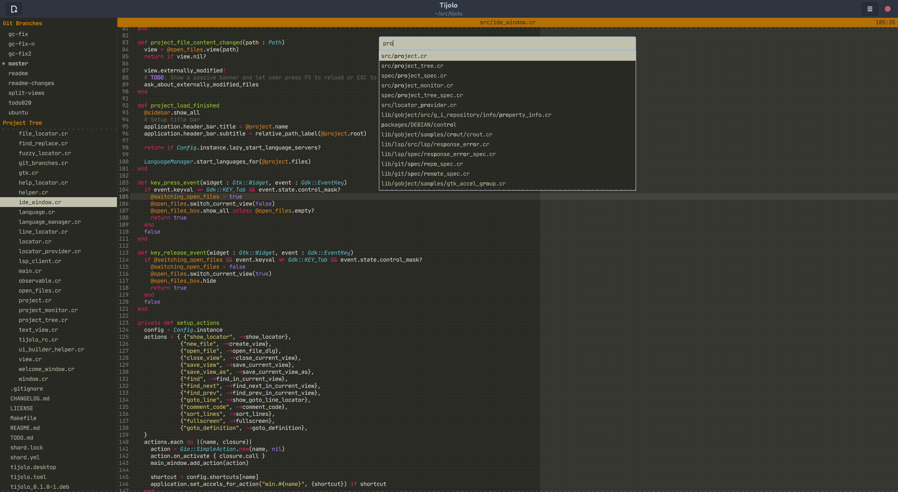

# Tijolo

Lightweight, keyboard-oriented IDE for the masses.

[](https://aur.archlinux.org/packages/tijolo)


## Project status

Being rewrite using GTK4 and LibAdwaita, the re-write isn't done yet but if you want to check the old version check the v0.7.1 tag.

CI still broken

The [TODO](./TODO.md) works like a roadmap and also list things I'm working on, it can give you a better idea of the project
status.

## How it looks like?



See more [screenshots](https://github.com/hugopl/tijolo/tree/master/screenshots).

## Project goals

- Run fast, something you don't see very often in new desktop applications.
- Have a simple distraction free UI.
- Keyboard focused user interface.
- Easy/fast code navigation.
- ♥️ Git.
- ♥️ Language Servers.

## Installing

### Archlinux

There's a AUR package for every release.

```
$ yay -S tijolo
```

There's also AUR package available for latest git version, named `tijolo-git`.

### Ubuntu

There should be a home made Ubuntu package for every release, check the
[github release page](https://github.com/hugopl/tijolo/releases).

If you want to create a package from git, clone the repository then run `./packages/make-ubuntu-package`, this will generate
a docker image, build Tijolo inside that image, create a debian package then copy it back, out of the container. Not best
approach to build a deb package but works on non-deb machines.

## Dependencies

You will need:

 - Crystal compiler version >= 1.0.0.
 - GTK3.
 - GTKSourceView4.
 - [Vte](https://gitlab.gnome.org/GNOME/vte).
 - GIR packages for these GTK libraries.
 - [libGit2](https://libgit2.org/).
 - [editorconfig-core](https://github.com/editorconfig/editorconfig-core-c).

### via apt

```shell
$ sudo apt-get install -y \
    git make crystal libeditorconfig-dev \
    libgirepository1.0-dev libgit2-dev \
    libgtksourceview-4-dev libvte-2.91-dev libyaml-dev
```

Names and versions may differ depending on distro and version

### via Homebrew/Linuxbrew

```shell
$ brew install crystal gtk+3 gobject-introspection gtksourceview4 vte3 \
               libgit2 editorconfig
```

### Other package managers

Check your distro's package managers for the equivalent package names. You will
need the install the `-dev` or `-devel` equivalent packages, in addition to the
runtime packages.

## Compiling from Source

```
$ make
$ sudo make install
```

Tijolo use [JetBrains Mono](https://www.jetbrains.com/lp/mono/) font, you can _make install_ them if you don't already have
them installed:

```
$ sudo make install-fonts
```

To uninstall:

```
$ sudo make uninstall uninstall-fonts
```

## Usage

Pass a directory of a file under a git repository to open a project. Just call it without arguments to see a list of available projects.

## Contributing

1. Fork it (<https://github.com/hugopl/tijolo/fork>)
2. Create your feature branch (`git checkout -b my-new-feature`)
3. Commit your changes (`git commit -am 'Add some feature'`)
4. Push to the branch (`git push origin my-new-feature`)
5. Create a new Pull Request

Any ideas/suggestions, fill in an issue.

## Contributors

- [Hugo Parente Lima](https://github.com/hugopl) - creator and maintainer
