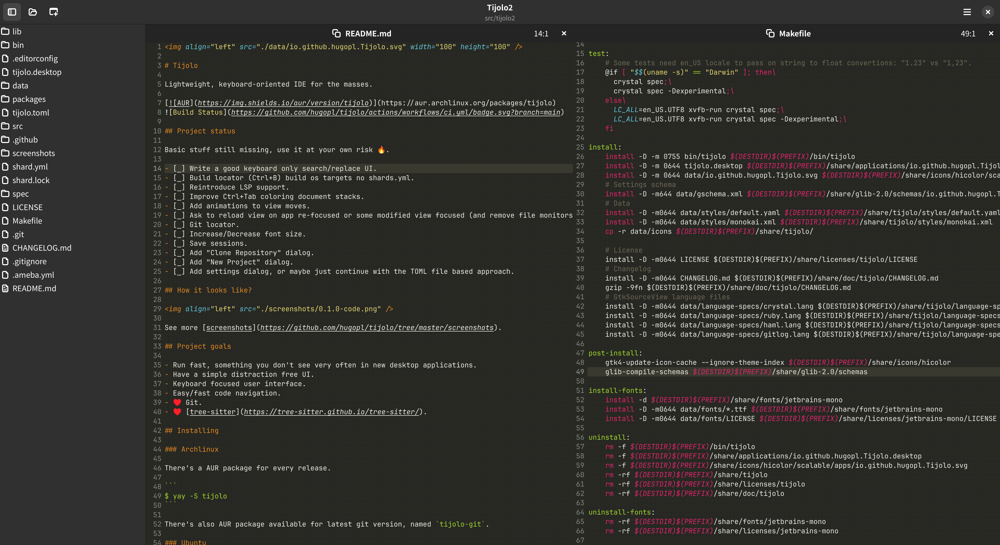

# Tijolo

Lightweight, keyboard-oriented IDE for the masses.

[](https://aur.archlinux.org/packages/tijolo)


## Project status

Basic stuff still missing, use it at your own risk 🔥️.

- [x] Write a good keyboard only search/replace UI.
- [ ] Build locator (Ctrl+B) build os targets no shards.yml.
- [ ] Reintroduce LSP support.
- [ ] Improve Ctrl+Tab coloring document stacks.
- [ ] Add animations to view moves.
- [ ] Ask to reload view on app re-focused or some modified view focused (and remove file monitors)
- [ ] Git locator.
- [ ] Increase/Decrease font size.
- [ ] Save sessions.
- [ ] Add "Clone Repository" dialog.
- [ ] Add "New Project" dialog.
- [ ] Add settings dialog, or maybe just continue with the TOML file based approach.
- [ ] Create a site with some documentation, otherwise I'll always be the only user for this.

## How it looks like?



See more [screenshots](https://github.com/hugopl/tijolo/tree/master/screenshots).

## Project goals

- Run fast, something you don't see very often in new desktop applications.
- Have a simple distraction free UI.
- Keyboard focused user interface.
- Easy/fast code navigation.
- ♥️ Git.
- ♥️ [tree-sitter](https://tree-sitter.github.io/tree-sitter/).

## Installing

### Archlinux

There's a AUR package for every release.

```
$ yay -S tijolo
```

There's also AUR package available for latest git version, named `tijolo-git`.

### Ubuntu

There should be a home made Ubuntu package for every release, check the
[github release page](https://github.com/hugopl/tijolo/releases).

If you want to create a package from git, clone the repository then run `./packages/make-ubuntu-package`, this will generate
a docker image, build Tijolo inside that image, create a debian package then copy it back, out of the container. Not best
approach to build a deb package but works on non-deb machines.

## Dependencies

You will need:

 - Crystal compiler version >= 1.10.0.
 - GTK4 >= 4.8.
 - LibAdwaita >= 1.4.
 - GTKSourceView5.
 - [Vte4](https://gitlab.gnome.org/GNOME/vte).
 - GIR packages for these GTK libraries.

## Compiling from Source

```
$ make
$ sudo make install
```

Tijolo use [JetBrains Mono](https://www.jetbrains.com/lp/mono/) font, you can _make install_ them if you don't already have
them installed:

```
$ sudo make install-fonts
```

To uninstall:

```
$ sudo make uninstall uninstall-fonts
```

To update GTK4 icon cache and compile gschema files run:

```
$ make post-install
```

## Usage

Pass a directory of a file under a git repository to open a project. Just call it without arguments to see a list of available projects.

## Contributing

1. Fork it (<https://github.com/hugopl/tijolo/fork>)
2. Create your feature branch (`git checkout -b my-new-feature`)
3. Commit your changes (`git commit -am 'Add some feature'`)
4. Push to the branch (`git push origin my-new-feature`)
5. Create a new Pull Request

Any ideas/suggestions, fill in an issue.

## Contributors

- [Hugo Parente Lima](https://github.com/hugopl) - creator and maintainer
